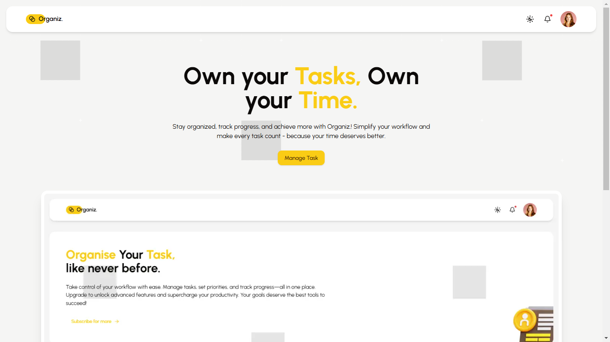
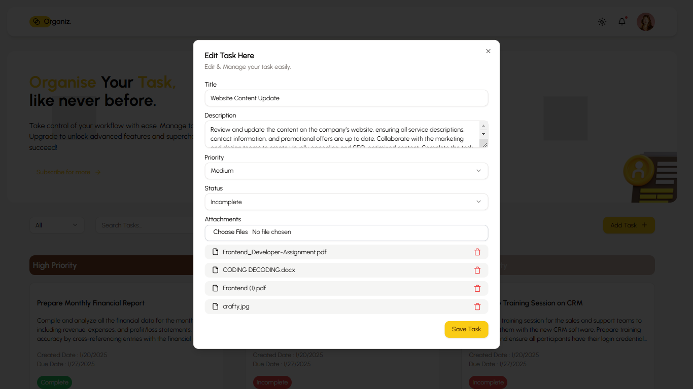
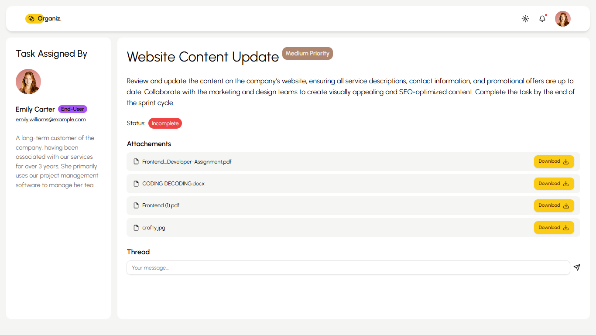
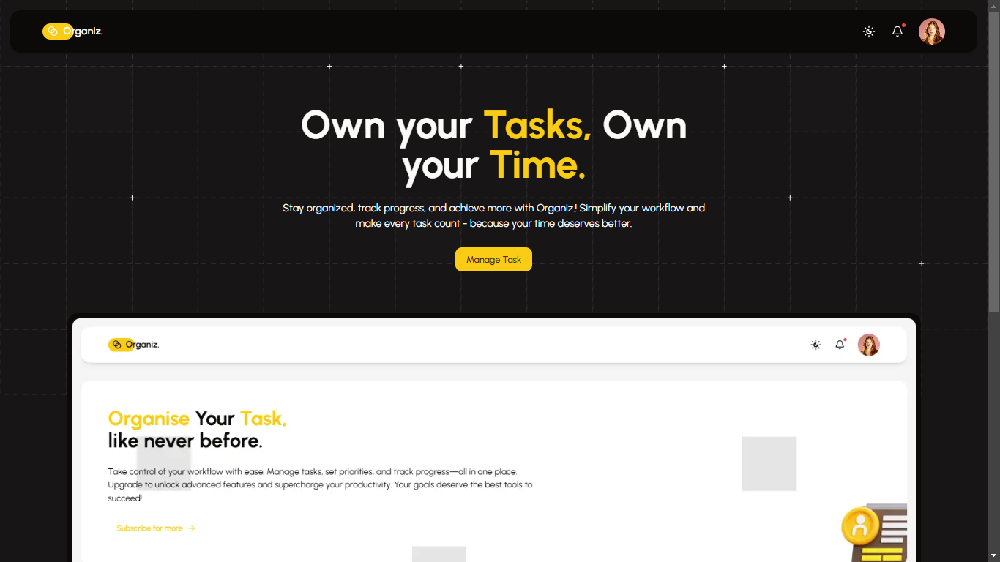
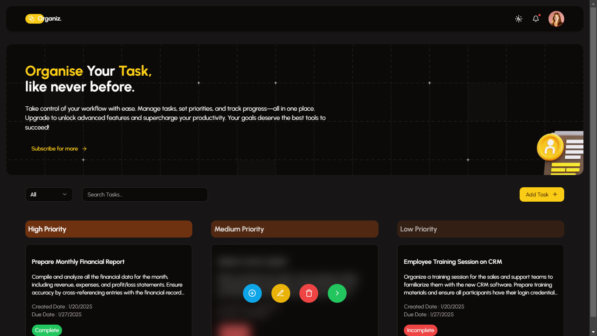
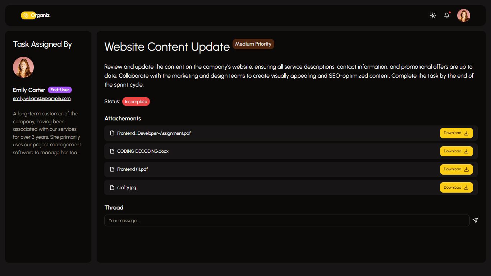

# Task Management App

A modern task management application that allows users to create, update, delete, and organize tasks with various features and task status management.

## Features

- **Task Creation**: Users can create tasks with a title, description, due date, and status.
- **Task Status Toggle**: Tasks can be toggled between "Incomplete" and "Complete" states.
- **Task Editing**: Users can edit the task's details.
- **Task Deletion**: Users can delete tasks.
- **Task Priority**: Tasks are organized based on their priority, and users can modify the priority through the interface.
- **Task List Display**: Tasks are displayed in a clean, user-friendly list format with detailed information.
- **Task Detail View**: Each Tasks has a detail page for seeing everything about task, the user who assigned the task and threads related to it.
- **Drag and Drop Feature**: Tasks can seamlessly have their priority updated by dragging and dropping them within the interface. This eliminates the need for manual edits, enhancing the user experience with an intuitive and interactive design.
- **Toggle Status Feature**: Users can easily switch a task's status between "Complete" and "Incomplete" by toggling a button. This straightforward action streamlines task management and improves usability.

## Screenshots

### Light Mode





### Dark Mode





## Technologies Used

- **Next.js**: Frontend framework for building the user interface.
- **Tailwind CSS**: Utility-first CSS framework for styling the app.
- **Shadcn UI**: For using reusable components.
- **Next Themes**: For switching between light & dark mode.
- **TypeScript**: For type safety and better developer experience.
- **Lucide Icons**: For incorporating vector icons into the interface.
- **@dnd-kit/core**: A drag-and-drop library.

## State Management

The app uses a **React Context API** for managing the global state of tasks.

### TaskProvider Details:

- **State Initialization:**

  - The `tasks` state is initialized with an empty array and is populated by retrieving saved tasks from `localStorage`, and each task get retreived with attributes like `id`, `title`, `description`, `createdAt`, `dueDate`, `status`, `priority` and `attachments`.

- **Persistent Storage:**
  - Tasks are saved to `localStorage` whenever they are updated, this ensures that data persist even after page reloads.

### Functions for State Modification:

- **addTask(task: Task):**

  - Adds a new task to the state and updates `localStorage`.

- **editTask(id: string, updatedTask: Partial<Task>):**

  - Modifies an existing task based on its `id`. Only updates fields provided in the `updatedTask` object.

- **deleteTask(id: string):**

  - Removes a task from the state by its `id`.

- **changePriority(id: string, priority: Task["priority"]):**

  - Updates the priority of a task by calling `editTask` internally (shortcut used for simple toggle UI without editing the form).

- **toggleStatus(id: string):**

  - Toggles the task's `status` between "Complete" and "Incomplete" (Shortcut used while drag & drop feature).

### How I Have Used:

- I have wrapped the app's component tree with `TaskProvider` to make the context available across the app.
- And used the `useTaskContext` hook in child components to access `tasks` and the task management functions.

### Advantages:

- Centralized state management reduces the need for prop drilling.
- LocalStorage integration ensures persistence without requiring a backend.

## Installation

### Prerequisites

- **Node.js**: Install the latest version of Node.js from [here](https://nodejs.org/).

### Step 1: Clone the Repository

Clone this repository to your local machine using:

```bash
git clone https://github.com/C0deepak/organiz.git
```

### Step 2: Install Necessary packages

Install the packages using:

```bash
npm i
```

### Step 3: Run the application

Run the development server, using:

```bash
npm run dev
# or
yarn dev
# or
pnpm dev
# or
bun dev
```

Open [http://localhost:3000](http://localhost:3000) with your browser to see the result.
You can start editing the page by modifying `app/page.tsx`. The page auto-updates as you edit the file.
